# gChess ♟️

> A modern, real-time multiplayer chess platform built with Kotlin, featuring WebSocket-based gameplay, automatic matchmaking, and a complete FIDE-compliant chess engine.

**gChess** is a production-ready chess application that demonstrates Domain-Driven Design, hexagonal architecture, and real-time communication. Players can register, join matchmaking queues, and play complete chess games with instant move updates via WebSockets.

[](https://kotlinlang.org/)
[](https://ktor.io/)
[](https://www.postgresql.org/)
[](LICENSE)

---

## 🎯 Project Overview

**gChess** combines a powerful chess engine with modern web technologies to deliver a seamless multiplayer chess experience:

- **Real-time gameplay**: WebSocket-based communication ensures instant move updates and matchmaking notifications
- **Automatic matchmaking**: FIFO queue system that pairs players and automatically creates games
- **Complete chess rules**: Bitboard-based engine with full FIDE compliance (castling, en passant, promotion, all draw conditions)
- **Clean architecture**: Domain-Driven Design with three bounded contexts (Chess, User, Matchmaking)
- **Production-ready**: PostgreSQL persistence, JWT authentication, comprehensive testing (100+ tests)

---

## ✨ Implemented Features

### 🔐 User Management & Security
- User registration with email validation
- JWT-based authentication (Bearer tokens, 24-hour validity)
- BCrypt password hashing (work factor 12)
- User profile retrieval
- ULID-based identifiers for all entities

### 🎮 Game Management
- **Real-time gameplay** via WebSocket connections
- **Automatic game creation** from matchmaking
- **Manual game creation** via REST API
- **Move validation** with complete chess rules
- **Game state persistence** with FEN notation
- **Move history tracking** with algebraic notation
- **Spectator mode** (read-only WebSocket connections)
- **Multi-device support** (play multiple games simultaneously)

### 🎲 Matchmaking System
- **Real-time FIFO matchmaking queue**
- **Instant match notifications** via WebSocket
- **Automatic color assignment** (random)
- **Queue position updates** in real-time
- **Auto-cleanup** on disconnection
- **5-minute match TTL** with expiration tracking
- **Persistent match records** in database

### ♟️ Chess Engine (Bitboard-Based)
- **All piece movements**: Pawn, Knight, Bishop, Rook, Queen, King
- **Special moves**:
  - ✅ Castling (kingside & queenside)
  - ✅ En passant capture
  - ✅ Pawn promotion (Queen, Rook, Bishop, Knight)
- **Check & checkmate detection**
- **Pinned piece handling** (pieces exposing king to check)
- **Protected piece validation** (king cannot capture defended pieces)
- **Game-ending conditions**:
  - ✅ Checkmate
  - ✅ Stalemate
  - ✅ Fifty-move rule
  - ✅ Threefold repetition
  - ✅ Insufficient material
- **FEN notation** support for position serialization
- **Bitboard architecture** for optimal performance

### 🌐 Real-Time Communication
- **Game WebSocket** (`/ws/game/{gameId}`) - Real-time move updates for players
- **Matchmaking WebSocket** (`/ws/matchmaking`) - Instant queue and match notifications
- **Spectator WebSocket** (`/ws/game/{gameId}/spectate`) - Watch games live (read-only)
- **JWT authentication** for all WebSocket connections
- **Automatic reconnection handling**
- **Player disconnect/reconnect notifications**

### 🏗️ Architecture & Quality
- **Domain-Driven Design** with 3 bounded contexts (Chess, User, Matchmaking)
- **Hexagonal architecture** (ports and adapters)
- **Anti-Corruption Layer (ACL)** for context isolation
- **100+ unit tests** with Kotest
- **Architecture tests** with ArchUnit (enforces DDD rules)
- **Integration tests** with Testcontainers (real PostgreSQL)
- **PostgreSQL persistence** with jOOQ and Liquibase migrations
- **Dependency injection** with Koin

---

## 🚀 Quick Start

### Prerequisites

- **Java 21** or higher
- **Docker** (for PostgreSQL and Testcontainers)
- **Gradle** (wrapper included)

### 1. Start PostgreSQL Database

The quickest way to get started is with Docker:

```bash
docker run -d \
  --name gchess-postgres \
  -e POSTGRES_DB=gchess_dev \
  -e POSTGRES_USER=gchess \
  -e POSTGRES_PASSWORD=gchess \
  -p 5432:5432 \
  postgres:16-alpine
```

Alternatively, use the provided `docker-compose.yml`:

```bash
cd docker && docker-compose up -d
```

Database migrations will run automatically on application startup via Liquibase.

### 2. Run the Application

```bash
./gradlew run
```

The server will start on **http://localhost:8080**

You should see:
```
✅ Database connection established
✅ Liquibase migrations applied (users, games, game_moves tables)
✅ Server ready on http://localhost:8080
```

### 3. Test the API

**Register a user:**
```bash
curl -X POST http://localhost:8080/api/auth/register \
  -H "Content-Type: application/json" \
  -d '{
    "username": "alice",
    "email": "alice@example.com",
    "password": "SecurePassword123"
  }'
```

**Login:**
```bash
curl -X POST http://localhost:8080/api/auth/login \
  -H "Content-Type: application/json" \
  -d '{"username": "alice", "password": "SecurePassword123"}'
```

Save the returned JWT token - you'll need it for authenticated requests!

---

## 🛠️ Development Environment

### Building the Project

```bash
# Full build with all tests
./gradlew build

# Build without tests
./gradlew assemble
```

### Testing

```bash
# Run all tests (unit + architecture + integration)
./gradlew check

# Run only unit tests (fast, 100+ tests)
./gradlew unitTest

# Run only architecture tests (ArchUnit DDD validation)
./gradlew architectureTest

# Run only integration tests (E2E with Testcontainers)
./gradlew integrationTest

# Run specific test class
./gradlew unitTest --tests "com.gchess.chess.domain.service.StandardChessRulesTest"
```

### Database Operations

```bash
# Regenerate jOOQ classes after schema changes
./gradlew generateJooq

# Manually run migrations (usually automatic on startup)
# Migrations are in src/main/resources/db/changelog/
```

### Code Quality

The project includes automated architecture validation:

```bash
# Validate hexagonal architecture and bounded context isolation
./gradlew architectureTest
```

**What gets validated:**
- ✅ Domain layer has no dependencies on infrastructure/application
- ✅ Bounded contexts are isolated (Chess cannot depend on User/Matchmaking)
- ✅ Only infrastructure can cross context boundaries (via ACL)
- ✅ Naming conventions (UseCase suffix, Repository suffix)

---

## 📡 API Reference

### REST API (Synchronous - Authentication Only)

gChess uses a **hybrid architecture**: REST for authentication, WebSocket for all real-time operations (matchmaking, gameplay).

| Endpoint | Method | Auth | Description |
|----------|--------|------|-------------|
| `/api/auth/register` | POST | ❌ | Register new user |
| `/api/auth/login` | POST | ❌ | Login and get JWT token |

**Example: Register**
```bash
POST /api/auth/register
Content-Type: application/json

{
  "username": "bob",
  "email": "bob@example.com",
  "password": "SecurePassword123"
}

# Response: 201 Created
{
  "id": "01HQZN2K3M4P5Q6R7S8T9V0W1X",
  "username": "bob",
  "email": "bob@example.com"
}
```

**Example: Login**
```bash
POST /api/auth/login
Content-Type: application/json

{
  "username": "bob",
  "password": "SecurePassword123"
}

# Response: 200 OK
{
  "user": {
    "id": "01HQZN2K3M4P5Q6R7S8T9V0W1X",
    "username": "bob",
    "email": "bob@example.com"
  },
  "token": "eyJhbGciOiJIUzI1NiIsInR5cCI6IkpXVCJ9..."
}
```

**Important**: After authentication, all game operations (matchmaking, moves, spectating) are done via WebSocket (see below).

---

### WebSocket API (Asynchronous - Real-Time)

All WebSocket endpoints require JWT authentication via query parameter:
```
ws://localhost:8080/ws/<endpoint>?token=<JWT_TOKEN>
```

#### 🎲 Matchmaking WebSocket

**URL**: `ws://localhost:8080/ws/matchmaking?token=<JWT>`

**Purpose**: Join matchmaking queue and receive instant match notifications

**Client → Server Messages**:
```json
{
  "type": "JoinQueue"
}
```

**Server → Client Messages**:

1. **Authentication Success**
```json
{
  "type": "AuthSuccess",
  "userId": "01HQZN2K3M4P5Q6R7S8T9V0W1X"
}
```

2. **Queue Position Update** (sent periodically)
```json
{
  "type": "QueuePositionUpdate",
  "position": 3
}
```

3. **Match Found** (triggers game creation)
```json
{
  "type": "MatchFound",
  "gameId": "01HQZN3A4B5C6D7E8F9G0H1J2K",
  "yourColor": "WHITE",
  "playerId": "01HQZN3B5C6D7E8F9G0H1J2K3L"
}
```

4. **Error Message**
```json
{
  "type": "MatchmakingError",
  "code": "ALREADY_IN_QUEUE",
  "message": "You are already in the matchmaking queue"
}
```

**Lifecycle**:
1. Connect with JWT
2. Send `JoinQueue` message
3. Receive queue position updates
4. On match found, receive game ID and color
5. Disconnect and connect to Game WebSocket

---

#### ♟️ Game WebSocket

**URL**: `ws://localhost:8080/ws/game/{gameId}?token=<JWT>`

**Purpose**: Real-time gameplay with instant move updates

**Client → Server Messages**:

1. **Move Attempt**
```json
{
  "type": "MoveAttempt",
  "from": "e2",
  "to": "e4",
  "promotion": null
}
```

For pawn promotion:
```json
{
  "type": "MoveAttempt",
  "from": "e7",
  "to": "e8",
  "promotion": "QUEEN"
}
```

**Server → Client Messages**:

1. **Game State Sync** (on connection)
```json
{
  "type": "GameStateSync",
  "gameId": "01HQZN3A4B5C6D7E8F9G0H1J2K",
  "positionFen": "rnbqkbnr/pppppppp/8/8/8/8/PPPPPPPP/RNBQKBNR w KQkq - 0 1",
  "moveHistory": [
    { "from": "e2", "to": "e4", "promotion": null }
  ],
  "gameStatus": "IN_PROGRESS",
  "currentSide": "BLACK",
  "whitePlayerId": "01HQZN3B5C6D7E8F9G0H1J2K3L",
  "blackPlayerId": "01HQZN3C6D7E8F9G0H1J2K3L4M"
}
```

2. **Move Executed** (broadcast to both players)
```json
{
  "type": "MoveExecuted",
  "gameId": "01HQZN3A4B5C6D7E8F9G0H1J2K",
  "from": "e2",
  "to": "e4",
  "promotion": null,
  "newPositionFen": "rnbqkbnr/pppppppp/8/8/4P3/8/PPPP1PPP/RNBQKBNR b KQkq e3 0 1",
  "gameStatus": "IN_PROGRESS",
  "nextSide": "BLACK"
}
```

3. **Move Rejected** (invalid move)
```json
{
  "type": "MoveRejected",
  "reason": "It's not your turn"
}
```

4. **Player Disconnected**
```json
{
  "type": "PlayerDisconnected",
  "playerId": "01HQZN3C6D7E8F9G0H1J2K3L4M",
  "side": "BLACK"
}
```

5. **Player Reconnected**
```json
{
  "type": "PlayerReconnected",
  "playerId": "01HQZN3C6D7E8F9G0H1J2K3L4M",
  "side": "BLACK"
}
```

**Lifecycle**:
1. Connect with JWT and gameId
2. Receive initial game state sync
3. Send move attempts when it's your turn
4. Receive move confirmations or rejections
5. Receive opponent's moves in real-time
6. Get notified of game ending (checkmate, stalemate, draw)

---

#### 👁️ Spectator WebSocket

**URL**: `ws://localhost:8080/ws/game/{gameId}/spectate?token=<JWT>`

**Purpose**: Watch games live (read-only)

**Server → Client Messages**: Same as Game WebSocket (cannot send messages)

---

## 📊 Complete User Journey (Sequence Diagram)

Here's a complete example of a user flow from registration to playing a game:

```mermaid
sequenceDiagram
    participant Alice as Client (Alice)
    participant Server as Ktor Server
    participant UseCases as Use Cases (Domain)
    participant DB as PostgreSQL

    Note over Alice,DB: STEP 1: REGISTRATION
    Alice->>Server: POST /api/auth/register<br/>{username, email, password}
    Server->>UseCases: RegisterUserUseCase
    UseCases->>UseCases: Hash password (BCrypt)
    UseCases->>DB: INSERT INTO users
    DB-->>UseCases: User created
    UseCases-->>Server: User
    Server-->>Alice: 201 Created<br/>{id, username, email}

    Note over Alice,DB: STEP 2: LOGIN
    Alice->>Server: POST /api/auth/login<br/>{username, password}
    Server->>UseCases: LoginUseCase
    UseCases->>DB: SELECT FROM users
    DB-->>UseCases: User record
    UseCases->>UseCases: Verify BCrypt
    UseCases->>UseCases: Generate JWT token
    UseCases-->>Server: User + Token
    Server-->>Alice: 200 OK<br/>{user, token}
    Note over Alice: Save JWT token

    Note over Alice,DB: STEP 3: JOIN MATCHMAKING (WebSocket)
    Alice->>Server: WS /ws/matchmaking?token=JWT
    Server->>Server: Validate JWT<br/>Extract userId
    Server-->>Alice: AuthSuccess
    Alice->>Server: {"type": "JoinQueue"}
    Server->>UseCases: JoinMatchmakingUseCase
    UseCases->>UseCases: Add to in-memory queue
    UseCases-->>Server: Queue position: 1
    Server-->>Alice: QueuePositionUpdate (position: 1)

    participant Bob as Client (Bob)
    Note over Bob,DB: Bob registers & logs in (same as Alice)
    Bob->>Server: WS /ws/matchmaking?token=JWT_BOB
    Server-->>Bob: AuthSuccess
    Bob->>Server: {"type": "JoinQueue"}
    Server->>UseCases: JoinMatchmakingUseCase
    UseCases->>UseCases: Match found!<br/>(Alice + Bob)

    Note over Server,DB: STEP 3.1: CREATE GAME FROM MATCH
    Server->>UseCases: CreateGameFromMatchUseCase
    UseCases->>UseCases: Assign random colors<br/>Create Player objects
    UseCases->>DB: INSERT INTO games
    DB-->>UseCases: Game created
    UseCases-->>Server: Game created
    Server-->>Alice: MatchFound<br/>{gameId, yourColor: "WHITE", playerId}
    Server-->>Bob: MatchFound<br/>{gameId, yourColor: "BLACK", playerId}

    Note over Alice,DB: STEP 4: CONNECT TO GAME (WebSocket)
    Alice->>Server: WS /ws/game/{gameId}?token=JWT_ALICE
    Server->>Server: Validate JWT<br/>Load game from DB<br/>Match userId→playerId
    Server-->>Alice: GameAuthSuccess
    Server-->>Alice: GameStateSync<br/>{positionFen, moveHistory, status, ...}

    Bob->>Server: WS /ws/game/{gameId}?token=JWT_BOB
    Server-->>Bob: GameAuthSuccess
    Server-->>Bob: GameStateSync

    Note over Alice,DB: STEP 5: PLAY MOVES
    Alice->>Server: {"type": "MoveAttempt",<br/>"from": "e2", "to": "e4"}
    Server->>UseCases: MakeMoveUseCase
    UseCases->>UseCases: Validate turn<br/>Validate move (chess rules)<br/>Update game state
    UseCases->>DB: UPDATE games
    UseCases->>DB: INSERT INTO game_moves
    DB-->>UseCases: Move saved
    UseCases-->>Server: Updated game
    Server-->>Alice: MoveExecuted<br/>{from: "e2", to: "e4", ...}
    Server-->>Bob: MoveExecuted<br/>{from: "e2", to: "e4", ...}

    Bob->>Server: {"type": "MoveAttempt",<br/>"from": "e7", "to": "e5"}
    Server->>UseCases: MakeMoveUseCase
    UseCases->>UseCases: Validate & execute
    UseCases->>DB: UPDATE games + INSERT move
    UseCases-->>Server: Updated game
    Server-->>Alice: MoveExecuted<br/>{from: "e7", to: "e5", ...}
    Server-->>Bob: MoveExecuted<br/>{from: "e7", to: "e5", ...}

    Note over Alice,Bob: ... game continues with alternating moves ...

    Note over Alice,DB: STEP 6: GAME ENDING (Checkmate)
    Alice->>Server: {"type": "MoveAttempt",<br/>"from": "d1", "to": "h5"}
    Server->>UseCases: MakeMoveUseCase
    UseCases->>UseCases: Validate move<br/>Execute move<br/>Detect CHECKMATE!<br/>Update status
    UseCases->>DB: UPDATE games (status=CHECKMATE)
    UseCases-->>Server: Game ended
    Server-->>Alice: MoveExecuted<br/>{gameStatus: "CHECKMATE", winner: "WHITE"}
    Server-->>Bob: MoveExecuted<br/>{gameStatus: "CHECKMATE", winner: "WHITE"}

    Note over Alice,Bob: Game over - both players can disconnect
```



### Key Points:

1. **Registration & Login**: Standard REST flow with JWT generation
2. **Matchmaking**: Real-time WebSocket queue with instant pairing
3. **Game Creation**: Automatic when two players match (random color assignment)
4. **Gameplay**: WebSocket-based with real-time move broadcasting
5. **Move Validation**: Complete chess rules (StandardChessRules service)
6. **Game Ending**: Automatic checkmate/stalemate/draw detection

---

## 🏗️ Architecture

### Domain-Driven Design with Bounded Contexts

```
┌─────────────────────────────────────────────────────────────┐
│                      Shared Kernel                          │
│  (UserId, PlayerId, GameId, Player, PlayerSide)             │
└──────────────────┬─────────────┬────────────────────────────┘
                   │             │             │
         ┌─────────┘             │             └─────────┐
         │                       │                       │
┌────────┴────────┐    ┌─────────┴────────┐    ┌────────┴────────┐
│ Chess Context   │    │ Matchmaking      │    │ User Context    │
│                 │    │ Context          │    │                 │
│ Domain:         │    │                  │    │ Domain:         │
│ • Game          │    │ Domain:          │    │ • User          │
│ • ChessPosition │    │ • Match          │    │ • Credentials   │
│ • ChessRules    │    │ • QueueEntry     │    │                 │
│ • Move, Piece   │    │ • MatchmakingResult   │                 │
│                 │    │                  │    │ Use Cases:      │
│ Use Cases:      │    │ Use Cases:       │    │ • RegisterUser  │
│ • CreateGame    │    │ • JoinMatchmaking│    │ • Login         │
│ • MakeMove      │    │ • LeaveQueue     │    │ • GetUser       │
│ • GetGame       │    │ • CreateGameFrom │    │                 │
│                 │    │   Match          │    │ Infra:          │
│ Infra:          │    │                  │    │ • AuthRoutes    │
│ • GameRoutes    │◄───┤ Infra:           │    │ • PostgresUser  │
│ • GameWebSocket │    │ • MatchmakingWS  │    │   Repository    │
│ • PostgresGame  │    │ • PostgresMatch  │    │ • BcryptPassword│
│   Repository    │    │   Repository     │    │   Hasher        │
│                 │    │ • InMemoryQueue  │    │ • JwtConfig     │
│ • GameEventNotifier  │ • MatchmakingNotifier │                 │
└─────────────────┘    └──────────────────┘    └─────────────────┘
         ▲                      │                        ▲
         │                      │                        │
         └──────────────────────┴────────────────────────┘
               Anti-Corruption Layer (ACL)
          • GameCreator (Matchmaking → Chess)
          • UserExistenceChecker (Chess ← User)
```

### Key Architectural Principles

1. **Bounded Context Isolation**: Each context (Chess, User, Matchmaking) is independent with no direct dependencies
2. **Anti-Corruption Layer (ACL)**: Adapters protect context boundaries
3. **Hexagonal Architecture**: Domain → Application → Infrastructure (ports and adapters)
4. **Value Objects**: Immutable, rich domain models (Move, Position, Player, etc.)
5. **Event-Driven Communication**: WebSocket notifiers for real-time updates
6. **Repository Pattern**: Data persistence abstraction

---

## 🔧 Technology Stack

| Component | Technology | Version |
|-----------|------------|---------|
| **Language** | Kotlin (JVM) | 2.2.21 |
| **Runtime** | Java | 21 |
| **Web Framework** | Ktor | 3.3.2 |
| **HTTP Engine** | Netty | (via Ktor) |
| **WebSocket** | Ktor WebSockets | 3.3.2 |
| **Database** | PostgreSQL | 16+ |
| **Database Access** | jOOQ | 3.20.8 |
| **Migrations** | Liquibase | 5.0.1 |
| **Connection Pool** | HikariCP | 7.0.2 |
| **Authentication** | JWT (auth0-jwt) | 4.4.0 |
| **Password Hashing** | BCrypt (jbcrypt) | 0.4 |
| **Unique IDs** | ULID | (sulky 8.3.0) |
| **DI Framework** | Koin | 4.1.0 |
| **Serialization** | Kotlinx Serialization | (via Ktor) |
| **Time/Date** | Kotlin Time (stdlib) | 2.2.21 |
| **Testing** | Kotest | 6.0.5 |
| **Architecture Tests** | ArchUnit | 1.4.1 |
| **Integration Tests** | Testcontainers | 2.0.2 |
| **Build Tool** | Gradle (KTS) | 8.x |
| **Logging** | Logback + SLF4J | 1.5.21 |
| **Documentation** | Kompendium (OpenAPI) | 3.14.4 |
| **CORS** | Ktor CORS | 3.3.2 |

---

## 🗄️ Database Schema

### Users Table
```sql
CREATE TABLE users (
  id VARCHAR(26) PRIMARY KEY,           -- ULID
  username VARCHAR(255) UNIQUE NOT NULL,
  email VARCHAR(255) UNIQUE NOT NULL,
  password_hash VARCHAR(60) NOT NULL,   -- BCrypt
  created_at TIMESTAMP NOT NULL,
  updated_at TIMESTAMP NOT NULL
);
CREATE INDEX idx_users_username_lower ON users (LOWER(username));
CREATE INDEX idx_users_email_lower ON users (LOWER(email));
```

### Games Table
```sql
CREATE TABLE games (
  id VARCHAR(26) PRIMARY KEY,           -- ULID
  white_user_id VARCHAR(26) NOT NULL REFERENCES users(id),
  black_user_id VARCHAR(26) NOT NULL REFERENCES users(id),
  white_player_id VARCHAR(26) NOT NULL, -- Ephemeral per-game player ID
  black_player_id VARCHAR(26) NOT NULL,
  board_fen TEXT NOT NULL,              -- Position in FEN notation
  current_side VARCHAR(10) NOT NULL,    -- "WHITE" or "BLACK"
  status VARCHAR(20) NOT NULL,          -- IN_PROGRESS, CHECKMATE, etc.
  created_at TIMESTAMP NOT NULL,
  updated_at TIMESTAMP NOT NULL
);
```

### Game Moves Table
```sql
CREATE TABLE game_moves (
  id BIGSERIAL PRIMARY KEY,
  game_id VARCHAR(26) NOT NULL REFERENCES games(id) ON DELETE CASCADE,
  move_number INT NOT NULL,
  from_square VARCHAR(2) NOT NULL,      -- e.g., "e2"
  to_square VARCHAR(2) NOT NULL,        -- e.g., "e4"
  promotion VARCHAR(10),                -- QUEEN, ROOK, BISHOP, KNIGHT
  created_at TIMESTAMP NOT NULL,
  UNIQUE (game_id, move_number)
);
```

**Note**: Matchmaking is handled in-memory (not persisted in database). When two players are matched, a game is created directly in the `games` table.

Migrations are managed by **Liquibase** in `src/main/resources/db/changelog/`

---

## ⚙️ Configuration

### Environment Variables

| Variable | Description | Default | Required |
|----------|-------------|---------|----------|
| `DATABASE_URL` | PostgreSQL JDBC URL | `jdbc:postgresql://localhost:5432/gchess_dev` | No |
| `DATABASE_USER` | Database username | `gchess` | No |
| `DATABASE_PASSWORD` | Database password | `gchess` | No |
| `DATABASE_POOL_SIZE` | HikariCP pool size | `10` | No |
| `JWT_SECRET` | JWT signing secret (256-bit min) | Dev default | **YES (prod)** |
| `JWT_VALIDITY_MS` | Token validity (milliseconds) | `86400000` (24h) | No |
| `PORT` | HTTP server port | `8080` | No |

**Production Security**:
```bash
# Generate secure JWT secret
export JWT_SECRET=$(openssl rand -base64 32)

# Set production database
export DATABASE_URL="jdbc:postgresql://prod-host:5432/gchess"
export DATABASE_USER="gchess_prod"
export DATABASE_PASSWORD="<secure-password>"

./gradlew run
```

---

## 🧪 Testing

The project has **100+ tests** organized into three categories:

### Unit Tests (`./gradlew unitTest`)
- **108+ tests** covering domain logic and use cases
- Chess rules validation (move generation, checkmate, stalemate, draws)
- Fast execution, no external dependencies
- Located in `src/unitTest/kotlin/`

### Architecture Tests (`./gradlew architectureTest`)
- **ArchUnit-based validation** of DDD and hexagonal architecture
- Enforces layer dependencies (domain → application → infrastructure)
- Validates bounded context isolation
- Prevents circular dependencies
- Located in `src/architectureTest/kotlin/`

### Integration Tests (`./gradlew integrationTest`)
- **End-to-end API testing** with real PostgreSQL (Testcontainers)
- Full authentication flow (register → login → JWT → gameplay)
- WebSocket communication testing
- Database persistence validation
- Located in `src/integrationTest/kotlin/`

**Run all tests:**
```bash
./gradlew check
```

---

## 📋 Current Limitations

- ❌ No JWT refresh mechanism (tokens expire after 24 hours)
- ❌ Matchmaking queue is in-memory (lost on restart; games persist)
- ❌ No ELO/rating system (simple FIFO matchmaking)
- ❌ No mutual draw agreement endpoint
- ❌ No game clocks/time controls
- ❌ No manual reconnection recovery (must reconnect manually)
- ❌ No rate limiting on API endpoints
- ❌ No game history/replay functionality

---

## 🚧 Future Enhancements

- [ ] JWT refresh tokens
- [ ] Persistent matchmaking queue (database-backed)
- [ ] ELO rating system
- [ ] Draw by mutual agreement
- [ ] Game clocks with time controls
- [ ] Move history with algebraic notation (e.g., "Nf3", "O-O")
- [ ] Game replay and analysis
- [ ] Opening book integration
- [ ] Rate limiting and throttling
- [ ] Mobile app (Kotlin Multiplatform)
- [ ] AI opponent (chess engine integration)

---

## 🤝 Contributing

Contributions are welcome! This project follows **Domain-Driven Design** and **hexagonal architecture** principles.

### How to Contribute

1. Fork the repository
2. Create a feature branch: `git checkout -b feature/amazing-feature`
3. Follow existing architecture patterns (hexagonal architecture and DDD)
4. Ensure all tests pass: `./gradlew check`
5. Commit with descriptive messages
6. Push to your branch: `git push origin feature/amazing-feature`
7. Open a Pull Request

### Architecture Guidelines

- ✅ Follow hexagonal architecture (ports and adapters)
- ✅ Respect bounded context isolation
- ✅ Domain layer must remain framework-agnostic
- ✅ Add tests for new features (unit + integration + architecture)
- ✅ Run `./gradlew architectureTest` to validate compliance

---

## 📄 License

This project is licensed under the **MIT License** - see the [LICENSE](LICENSE) file for details.

**TL;DR**: Free to use, modify, and distribute. Just keep the license notice. 🎉

---

## 🎮 Try It Out!

**Start the server:**
```bash
docker run -d --name gchess-postgres -e POSTGRES_DB=gchess_dev -e POSTGRES_USER=gchess -e POSTGRES_PASSWORD=gchess -p 5432:5432 postgres:16-alpine
./gradlew run
```

**Open two terminals and play a game:**

Terminal 1 (Alice):
```bash
# Register
curl -X POST http://localhost:8080/api/auth/register -H "Content-Type: application/json" -d '{"username":"alice","email":"alice@example.com","password":"pass123"}'

# Login and save token
TOKEN_ALICE=$(curl -X POST http://localhost:8080/api/auth/login -H "Content-Type: application/json" -d '{"username":"alice","password":"pass123"}' | jq -r '.token')

# Connect to matchmaking WebSocket (use a WebSocket client like wscat)
wscat -c "ws://localhost:8080/ws/matchmaking?token=$TOKEN_ALICE"
> {"type":"JoinQueue"}
```

Terminal 2 (Bob):
```bash
# Register
curl -X POST http://localhost:8080/api/auth/register -H "Content-Type: application/json" -d '{"username":"bob","email":"bob@example.com","password":"pass123"}'

# Login
TOKEN_BOB=$(curl -X POST http://localhost:8080/api/auth/login -H "Content-Type: application/json" -d '{"username":"bob","password":"pass123"}' | jq -r '.token')

# Connect and match
wscat -c "ws://localhost:8080/ws/matchmaking?token=$TOKEN_BOB"
> {"type":"JoinQueue"}

# Both players receive MatchFound with gameId!
```

Now connect to the game WebSocket and start playing! ♟️

---

**Made with ❤️ using Kotlin, Ktor, and Domain-Driven Design**
